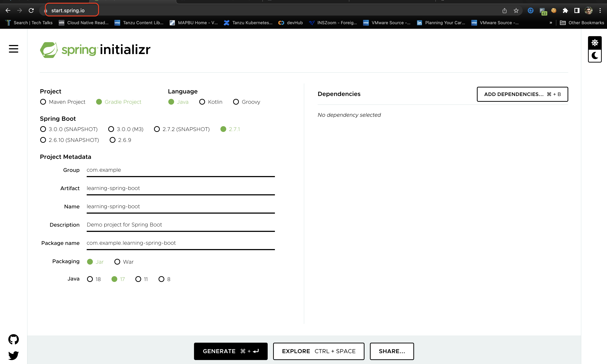

# learning-spring-boot

A repository for learning spring-boot. Each commit introduces a different feature.

## Pre-requisites

- Java 17 or higher
- Gradle
- A nice IDE (Intellij Idea, VS Code, Eclipse, etc)

## Installing Pre-requisites

### Java 17  

Try installing with `brew`

```bash
brew install openjdk
```

Check java version after successful installation

```bash
java -version
```

If you don't see the required version, try the following method

Download Java 17 from [jdk17-archive-downloads](https://www.oracle.com/java/technologies/javase/jdk17-archive-downloads.html) and install it.

Check java version after successful installation

```bash
java -version
```

### Gradle

Installing with `brew`

```bash
brew install gradle
```

## Create application 

* Go to [start.spring.io](https://start.spring.io/) and make selections as shown in the screenshot below.



* Click on `Generate` to download generated application archive

* Un-archive your application to your workspace location

## Build

```
./gradlew clean build
```

## Run

```
java -jar build/libs/learning-spring-boot-1.0.jar
```

> If you want to build and run the application with just one command, use `./gradlew clean bootrun`

Check your endpoints

```bash
curl localhost:8080/greeting/10
```