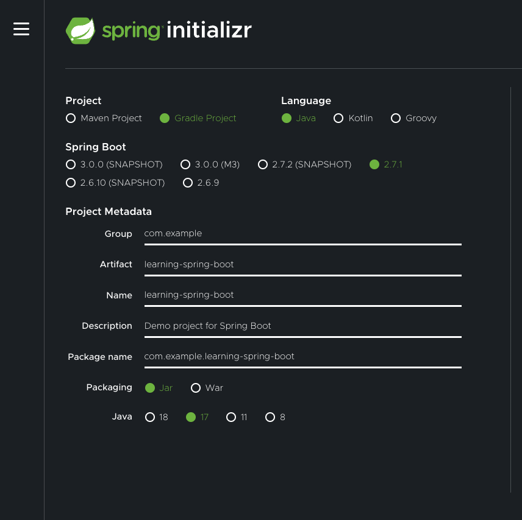
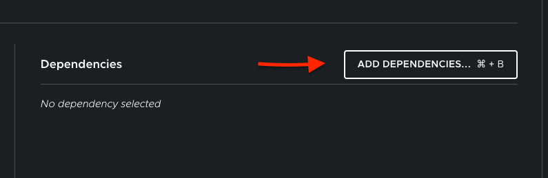
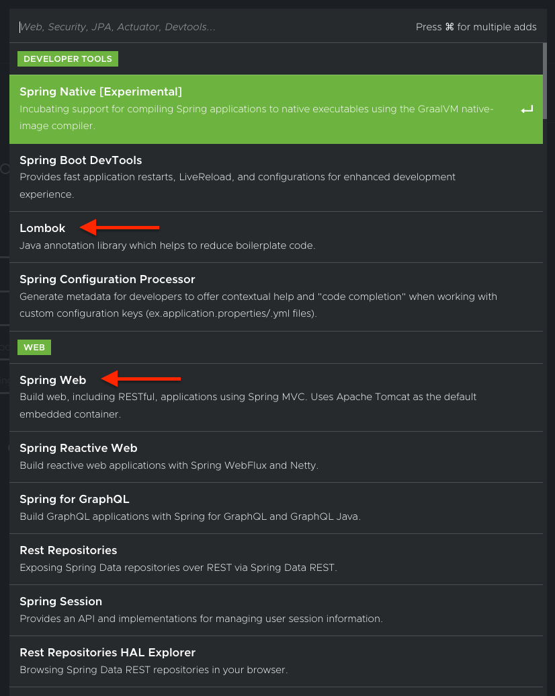
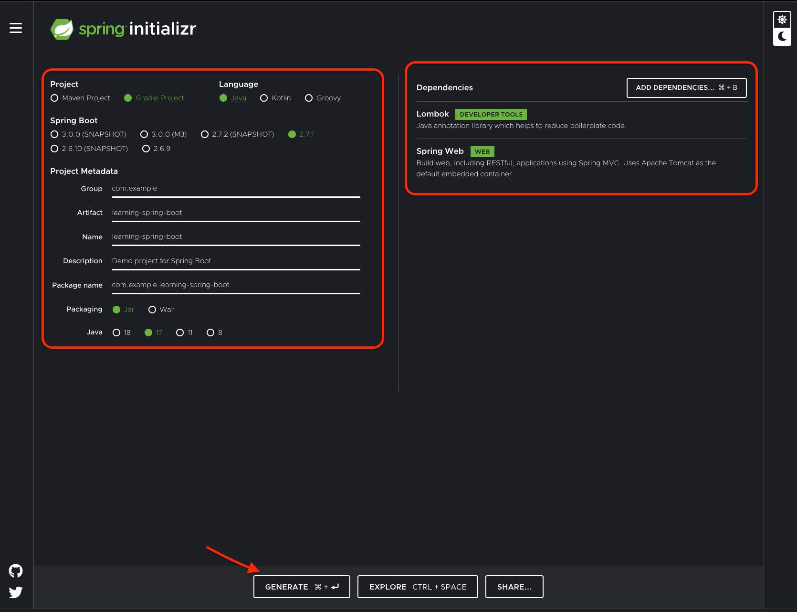
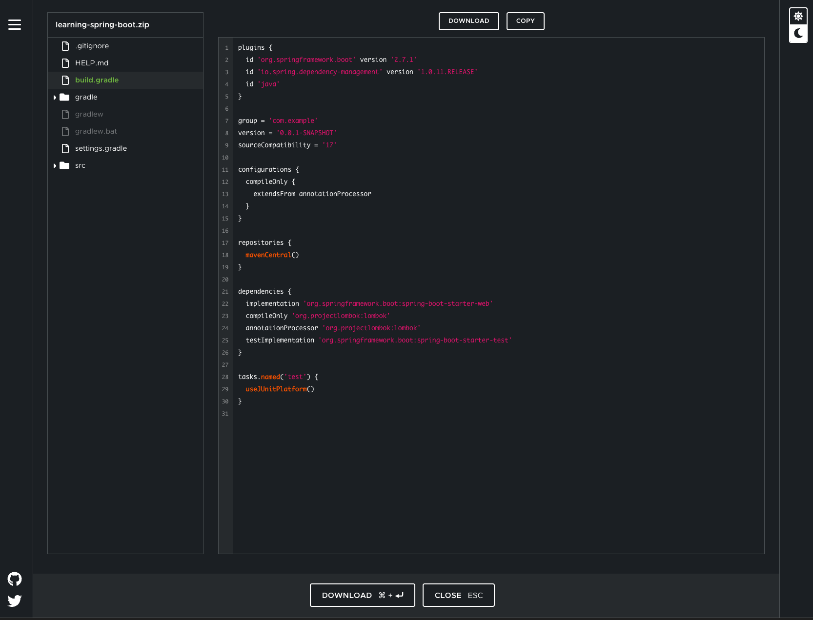

# Create application with spring initializer

* Go to [start.spring.io](https://start.spring.io/) and make selections as shown in the screenshot below.

* Click on `Add Dependencies` to add required dependencies

* Click on `Generate` to download generated application archive

* Un-archive your application to your workspace location

**Note:**
If you want to preview the project structure and contents, click on `Explore` button

